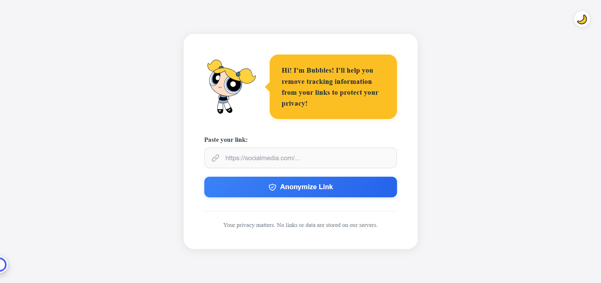
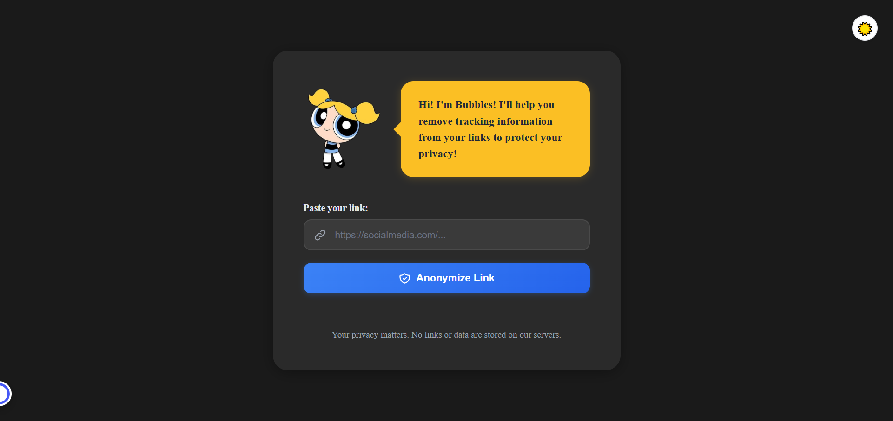

# 🔗 Link Anonymizer

A privacy-focused web application that removes tracking parameters from URLs to protect your online privacy. Built with React and TypeScript, featuring a friendly interface with Bubbles from the Powerpuff Girls as your privacy guide!

🌐 **Live Demo:** [https://link-anonymizer.netlify.app/](https://link-anonymizer.netlify.app/)

---

## 📸 Screenshots

### Light Mode


### Dark Mode


---

## ✨ Features

- 🔒 **Privacy First** - Removes tracking parameters from URLs (utm_*, fbclid, gclid, etc.)
- 🎨 **Modern UI** - Clean, responsive design that works on all devices
- 🌓 **Dark Mode** - Toggle between light and dark themes
- 📋 **One-Click Copy** - Easy clipboard integration
- 🔍 **Transparency** - Shows exactly what tracking data was removed
- 💨 **No Storage** - All processing happens client-side, nothing is stored
- ⚡ **Fast & Lightweight** - Instant results with no server delays
- 📱 **Fully Responsive** - Optimized for desktop, tablet, and mobile

---

## 🛠️ Technologies Used

- **React 19** - Latest React with enhanced performance and features
- **TypeScript 5.9** - Type-safe development with advanced type system
- **Vite 7** - Next-generation frontend tooling for blazing-fast builds
- **ESLint** - Code quality and consistency
- **CSS3** - Custom styling with modern CSS features
- **Netlify** - Continuous deployment and hosting

---

## 🚀 Getting Started

### Prerequisites

- Node.js (v16 or higher)
- npm or yarn

### Installation

1. Clone the repository
```bash
git clone https://github.com/yourusername/link-anonymizer.git
cd link-anonymizer
```

2. Install dependencies
```bash
npm install
# or
yarn install
```

3. Start the development server
```bash
npm run dev
# or
yarn dev
```

4. Open your browser and navigate to `http://localhost:5173`

### Build for Production

```bash
npm run build
# or
yarn build
```

The optimized production build will be in the `dist` folder.

---

## 📖 How It Works

1. **Paste Your Link** - Enter any URL with tracking parameters
2. **Anonymize** - Click the button to remove all tracking data
3. **Copy & Share** - Get your clean, privacy-respecting link
4. **See What Was Removed** - View a detailed list of removed tracking parameters

### Example

**Before:**
```
https://example.com/product?utm_source=facebook&utm_medium=cpc&fbclid=IwAR123
```

**After:**
```
https://example.com/product
```

**Removed Tracking Parameters:**
- utm_source
- utm_medium
- fbclid

---

## 🔐 Privacy & Security

- ✅ **No Data Collection** - We don't store, log, or transmit your URLs
- ✅ **Client-Side Processing** - All anonymization happens in your browser
- ✅ **No Analytics** - We don't track your usage
- ✅ **Open Source** - Full transparency in how your data is handled

---

## 🎯 Supported Tracking Parameters

The application removes common tracking parameters including:

### Marketing & Analytics
- `utm_source`, `utm_medium`, `utm_campaign`
- `utm_term`, `utm_content`

### Social Media
- `fbclid` (Facebook)
- `gclid` (Google Ads)
- `msclkid` (Microsoft/Bing)

### Email Marketing
- `mc_cid`, `mc_eid` (MailChimp)


---

## 📁 Project Structure

```
link-anonymizer/
├── src/
│   ├── assets/           # Images and static assets
│   ├── utils/
│   │   ├── urlAnonymizer.ts   # URL processing logic
│   │   └── styles.ts          # Style exports
│   ├── App.tsx           # Main application component
│   ├── App.css           # Application styles
│   └── main.tsx          # Application entry point
├── public/               # Public assets
├── index.html
├── package.json
├── tsconfig.json
├── vite.config.ts
└── README.md
```

---

## 🤝 Contributing

Contributions are welcome! Feel free to:

1. Fork the project
2. Create your feature branch (`git checkout -b feature/AmazingFeature`)
3. Commit your changes (`git commit -m 'Add some AmazingFeature'`)
4. Push to the branch (`git push origin feature/AmazingFeature`)
5. Open a Pull Request

---

## 🐛 Known Issues & Future Improvements

### Planned Features
- [ ] Support for more tracking parameters
- [ ] Batch URL processing
- [ ] Browser extension
- [ ] URL shortening integration
- [ ] Export history feature
- [ ] Custom tracking parameter lists

---

## 📝 License

This project is licensed under the MIT License - see the [LICENSE](LICENSE) file for details.

---

## 👨‍💻 Author

**Zamzam Abdelgawad**
- Portfolio: [zamzam-portfolio.com](https://zamzam-portfolio.netlify.app/)
- LinkedIn: [linkedin.com/in/zamzam-abdelgawad](https://www.linkedin.com/in/zamzam-abdelgawad/)
- GitHub: [@zamzam-abdelgawad](https://github.com/zamzam-abdelgawad)
- Email: zamzamabdelgawad@gmail.com

---

## 🙏 Acknowledgments

- Character design inspired by Bubbles from Powerpuff Girls
- Built with ❤️ for privacy-conscious internet users
- Thanks to the open-source community

---

## 📊 Project Stats


---

## 💡 Use Cases

- **Content Creators** - Share clean links in your content
- **Privacy Advocates** - Remove tracking before sharing
- **Developers** - Test URLs without tracking interference
- **Regular Users** - Protect your privacy when sharing links
- **Marketers** - Analyze URLs for tracking parameters

---

## 🔗 Related Projects

- [ClearURLs](https://github.com/ClearURLs/Addon) - Browser extension for URL cleaning
- [Privacy Badger](https://privacybadger.org/) - Browser extension that blocks trackers

---

<div align="center">

**Made with ❤️ for a more private web**

[⬆ Back to Top](#-link-anonymizer)

</div>
